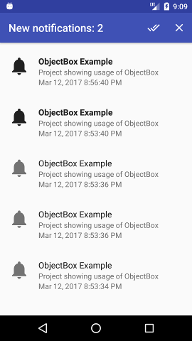

# ObjectBox Example

Project showing usage of [ObjectBox](http://greenrobot.org/objectbox/).

Application receives push notifications and shows them on list. Notifications can be:
- removed
- marked as read

Notifications on list are refreshed automatically. 



## Setup

In order to setup project you have to create new Firebase project with applicationId of this one.
Than download google-services.json and put in app folder. 
Server key for sending messages can be found in Cloud Messaging tab in Firebase project settings. 

To send notifications:

```
https://fcm.googleapis.com/fcm/send
Content-Type:application/json
Authorization:key=AIzaSyZ-1u...0GBYzPu7Udno5aA

{
  "to": "/topics/notifications",
  "data": {
    "title": "Some title",
    "body": "Some body"
  }
}
```

## Other used libraries

- [Dagger 2](http://google.github.io/dagger/)
- [RxJava 2](https://github.com/ReactiveX/RxJava)
- [Databinding](https://developer.android.com/topic/libraries/data-binding/index.html)
- [binding-collection-adapter](https://github.com/evant/binding-collection-adapter)
- [AndroidAnnotations](http://androidannotations.org/)
- [Firebase](https://firebase.google.com/)
- [ThreeTenABP](https://github.com/JakeWharton/ThreeTenABP)
- [AutoFactory](https://github.com/google/auto/tree/master/factory)